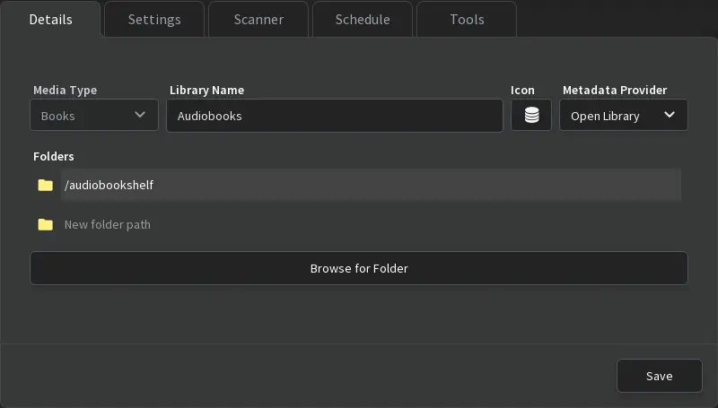

<!--
SPDX-FileCopyrightText: 2020 - 2024 MDAD project contributors
SPDX-FileCopyrightText: 2020 - 2024 Slavi Pantaleev
SPDX-FileCopyrightText: 2020 Aaron Raimist
SPDX-FileCopyrightText: 2020 Chris van Dijk
SPDX-FileCopyrightText: 2020 Dominik Zajac
SPDX-FileCopyrightText: 2020 Mickaël Cornière
SPDX-FileCopyrightText: 2022 François Darveau
SPDX-FileCopyrightText: 2022 Julian Foad
SPDX-FileCopyrightText: 2022 Warren Bailey
SPDX-FileCopyrightText: 2023 Antonis Christofides
SPDX-FileCopyrightText: 2023 Felix Stupp
SPDX-FileCopyrightText: 2023 Julian-Samuel Gebühr
SPDX-FileCopyrightText: 2023 Pierre 'McFly' Marty
SPDX-FileCopyrightText: 2024 - 2025 Suguru Hirahara

SPDX-License-Identifier: AGPL-3.0-or-later
-->

# audiobookshelf

The playbook can install and configure [audiobookshelf](https://www.audiobookshelf.org) for you.

audiobookshelf is a self-hosted audiobook and podcast server.

See the project's [documentation](https://www.audiobookshelf.org/docs/) to learn what audiobookshelf does and why it might be useful to you.

For details about configuring the [Ansible role for audiobookshelf](https://app.radicle.xyz/nodes/seed.radicle.garden/rad%3Az3rwhJ9rQ82H6GXg7ZCt3UNpStbaW), you can check them via:
- 🌐 [the role's documentation](https://app.radicle.xyz/nodes/seed.radicle.garden/rad%3Az3rwhJ9rQ82H6GXg7ZCt3UNpStbaW/tree/docs/configuring-audiobookshelf.md) online
- 📁 `roles/galaxy/audiobookshelf/docs/configuring-audiobookshelf.md` locally, if you have [fetched the Ansible roles](../installing.md)

## Dependencies

This service requires the following other services:

- [Traefik](traefik.md) reverse-proxy server

## Adjusting the playbook configuration

To enable this service, add the following configuration to your `vars.yml` file and re-run the [installation](../installing.md) process:

```yaml
########################################################################
#                                                                      #
# audiobookshelf                                                       #
#                                                                      #
########################################################################

audiobookshelf_enabled: true

audiobookshelf_hostname: audiobookshelf.example.com

########################################################################
#                                                                      #
# /audiobookshelf                                                      #
#                                                                      #
########################################################################
```

**Note**: hosting audiobookshelf under a subpath (by configuring the `audiobookshelf_path_prefix` variable) does not seem to be possible due to audiobookshelf's technical limitations.

### Syncthing integration (optional)

If you've got a [Syncthing](syncthing.md) service running, you can use it to synchronize your audiobookshelf directory onto the server and then mount it as read-only into the audiobookshelf container.

We recommend that you make use of the [aux](auxiliary.md) role to create some shared directory like this:

```yaml
########################################################################
#                                                                      #
# aux                                                                  #
#                                                                      #
########################################################################

aux_directory_definitions:
  - dest: "{{ mash_playbook_base_path }}/storage"
  - dest: "{{ mash_playbook_base_path }}/storage/audiobookshelf"

########################################################################
#                                                                      #
# /aux                                                                 #
#                                                                      #
########################################################################
```

You can then mount this `{{ mash_playbook_base_path }}/storage/audiobookshelf` directory into the Syncthing container and synchronize it with some other computer:

```yaml
########################################################################
#                                                                      #
# syncthing                                                            #
#                                                                      #
########################################################################

# Other Syncthing configuration..

syncthing_container_additional_volumes:
  - type: bind
    src: "{{ mash_playbook_base_path }}/storage/audiobookshelf"
    dst: /audiobookshelf

########################################################################
#                                                                      #
# /syncthing                                                           #
#                                                                      #
########################################################################
```

Finally, mount the `{{ mash_playbook_base_path }}/storage/audiobookshelf` directory into the audiobookshelf container as read-only:

```yaml
########################################################################
#                                                                      #
# audiobookshelf                                                       #
#                                                                      #
########################################################################

# Other audiobookshelf configuration..

audiobookshelf_container_additional_volumes:
  - type: bind
    src: "{{ mash_playbook_base_path }}/storage/audiobookshelf"
    dst: /audiobookshelf
    options: readonly

########################################################################
#                                                                      #
# /audiobookshelf                                                      #
#                                                                      #
########################################################################
```

After restarting the services, you can add the directory `/audiobookshelf` to Syncthing for file synchronization between the server and your local machine, and specify the same path to the library on audiobookshelf as below, so that the audiobooks on your local machine will be synchronized and available on the audiobookshelf instance automatically:

[](../assets/audiobookshelf/library.webp)

## Usage

After running the command for installation, the audiobookshelf instance becomes available at the URL specified with `audiobookshelf_hostname`. With the configuration above, the service is hosted at `https://audiobookshelf.example.com`.

To get started, open the URL with a web browser, and register the account. **Note that the first registered user becomes an administrator automatically.**

See [this page](https://www.audiobookshelf.org/docs/) on the documentation about its usage.

If you are looking for free public domain audiobooks which can be uploaded to your audiobookshelf instance, you might be interested in websites such as <https://librivox.org/>.

### Configure the SMTP server (optional)

On audiobookshelf you can add configuration settings of a SMTP server to let the service send email to e-reader devices. If you enable the [exim-relay](exim-relay.md) service in your inventory configuration, the playbook will automatically configure it as a mailer for the service.

As the audiobookshelf instance does not support configuring the mailer with environment variables, you can add default options for it on its UI. Refer to [this page](https://www.audiobookshelf.org/guides/send_to_ereader/) on the official documentation as well about how to configure it.

To set up with the default exim-relay settings, open `https://audiobookshelf.example.com/audiobookshelf/config/email` to add the following configuration:

- **Host**: `mash-exim-relay`
- **Port**: 8025
- **Secure**: (off)
- **Reject unauthorized certificates**: (off)
- **Username**: (Empty)
- **Password**: (Empty)
- **From Address**: (Input the email address specified to `exim_relay_sender_address` on your `vars.yml`)

After setting the configuration, you can have the audiobookshelf instance send a test mail.

## Troubleshooting

See [this section](https://app.radicle.xyz/nodes/seed.radicle.garden/rad%3Az3rwhJ9rQ82H6GXg7ZCt3UNpStbaW/tree/docs/configuring-audiobookshelf.md#troubleshooting) on the role's documentation for details.

## Recommended other services

- [Calibre-Web](calibre-web.md) — Web app for browsing, reading and downloading eBooks stored in a [Calibre](https://calibre-ebook.com/) database
- [Syncthing](syncthing.md) — a continuous file synchronization program which synchronizes files between two or more computers in real time. See [Syncthing integration](#syncthing-integration)
