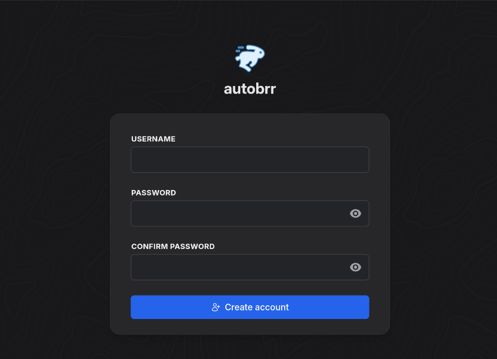

<!--
SPDX-FileCopyrightText: 2025 MASH project contributors
SPDX-FileCopyrightText: 2025 Suguru Hirahara

SPDX-License-Identifier: AGPL-3.0-or-later
-->

# Autobrr

[Autobrr](https://autobrr.com/) is a modern autodl-irssi replacement, an easy to use download automator for torrents and usenet.

## Dependencies

This service requires the following other services:

- a [Traefik](traefik.md) reverse-proxy server

## Configuration

To enable this service, add the following configuration to your `vars.yml` file and re-run the [installation](../installing.md) process:

```yaml
########################################################################
#                                                                      #
# autobrr                                                              #
#                                                                      #
########################################################################

autobrr_enabled: true

autobrr_hostname: autobrr.example.com

########################################################################
#                                                                      #
# /autobrr                                                             #
#                                                                      #
########################################################################
```

## Usage

After running the command for installation, the Autobrr instance becomes available at the URL specified with `autobrr_hostname`. With the configuration above, the service is hosted at `https://autobrr.example.com`.

>[!NOTE]
> The `autobrr_path_prefix` variable can be adjusted to host under a subpath (e.g. `autobrr_path_prefix: /autobrr`), but this hasn't been tested yet.

You should access your new Autobrr instance at the URL you've chosen. Follow the prompts to finish setup:



## Recommended other services

Consider these other related services:

- [Jackett](jackett.md)
- [Jellyfin](jellyfin.md)
- [Overseerr](overseerr.md)
- [Plex](plex.md)
- [qBittorrent](qbittorrent.md)
- [Radarr](radarr.md)
- [Sonarr](sonarr.md)
