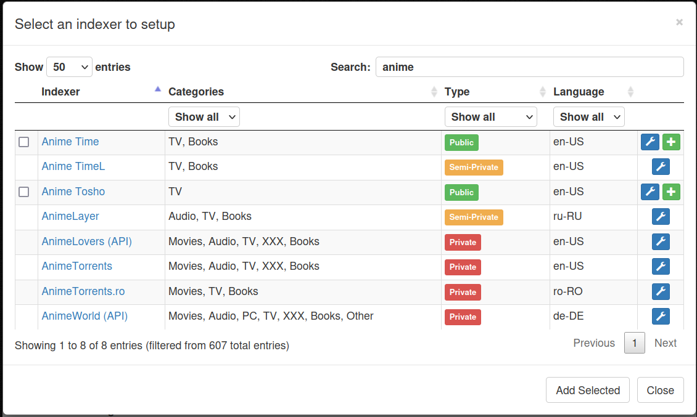
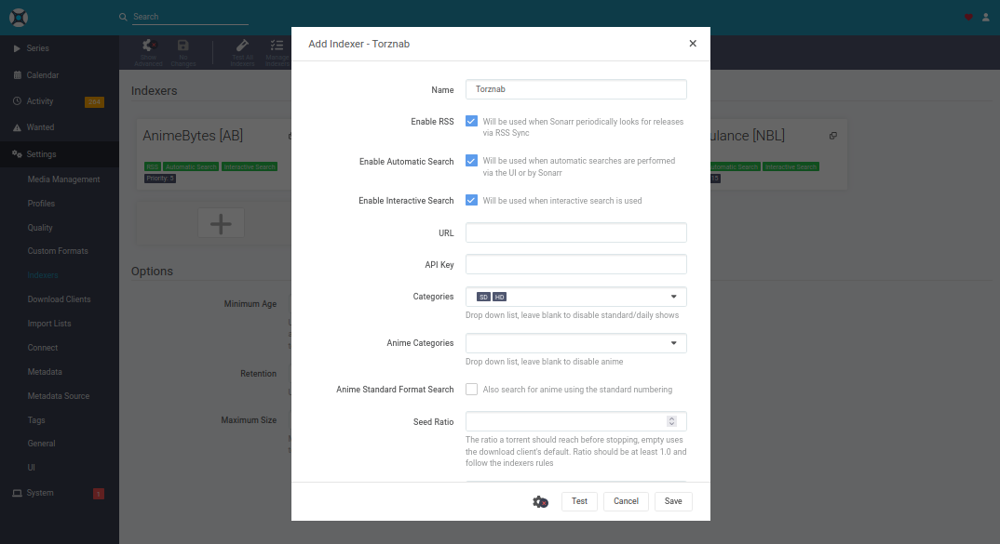
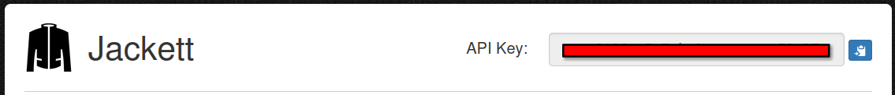

# Jackett

[Jackett](https://github.com/Jackett/Jackett) is an API for your favorite torrent trackers.

> Jackett works as a proxy server: it translates queries from apps ([Sonarr](https://github.com/Sonarr/Sonarr), [Radarr](https://github.com/Radarr/Radarr), [SickRage](https://sickrage.github.io/), [CouchPotato](https://couchpota.to/), [Mylar3](https://github.com/mylar3/mylar3), [Lidarr](https://github.com/lidarr/lidarr), [DuckieTV](https://github.com/SchizoDuckie/DuckieTV), [qBittorrent](https://www.qbittorrent.org/), [Nefarious](https://github.com/lardbit/nefarious), [NZBHydra2](https://github.com/theotherp/nzbhydra2) etc.) into tracker-site-specific http queries, parses the html or json response, and then sends results back to the requesting software. This allows for getting recent uploads (like RSS) and performing searches. Jackett is a single repository of maintained indexer scraping & translation logic — removing the burden from other apps.

## Dependencies

This service requires the following other services:

- a [Traefik](traefik.md) reverse-proxy server

## Configuration

To enable this service, add the following configuration to your `vars.yml` file and re-run the [installation](../installing.md) process:

```yaml
########################################################################
#                                                                      #
# jackett                                                              #
#                                                                      #
########################################################################

jackett_enabled: true

jackett_hostname: jackett.example.com

# To mount additional data directories, use `jackett_container_additional_volumes`
#
# Example:
# jackett_container_additional_volumes:
#   - type: bind
#     src: /path/to/blackhole
#     dst: /downloads

########################################################################
#                                                                      #
# /jackett                                                             #
#                                                                      #
########################################################################
```

### URL

In the example configuration above, we configure the service to be hosted at `https://jackett.example.com`.

A `jackett_path_prefix` variable can be adjusted to host under a subpath (e.g. `jackett_path_prefix: /jackett`), but this hasn't been tested yet.

## Usage

After [installation](../installing.md), you should access your new Jackett instance at the URL you've chosen and configure a Admin password.

For additional configuration options, refer to [ansible-role-jackett](https://github.com/spatterIight/ansible-role-jackett)'s `defaults/main.yml` file.

## Command-line arguments

Additional command line arguments can be passed to Jackett by use of the `RUN_OPTS` environment variable. To specify this, add the following to your configuration:

```yaml
# To add additional environment variables, use `jackett_container_additional_environment_variables`
#
# Example:
# jackett_container_additional_environment_variables: |
#   RUN_OPTS="--IgnoreSslErrors true --ProxyConnection 192.168.10.3:9999"
```

The full list of available arguments is as follows:

```sh
Jackett v0.22.1377
  -i, --Install            Install Jackett windows service (Must be admin)

  -r, --ReserveUrls        (Re)Register windows port reservations (Required for
                           listening on all interfaces).

  -u, --Uninstall          Uninstall Jackett windows service (Must be admin).

  -l, --Logging            Log all requests/responses to Jackett

  -t, --Tracing            Enable tracing

  -c, --UseClient          Override web client selection.
                           [automatic(Default)/httpclient/httpclient2]

  -s, --Start              Start the Jacket Windows service (Must be admin)

  -k, --Stop               Stop the Jacket Windows service (Must be admin)

  -x, --ListenPublic       Listen publicly

  -z, --ListenPrivate      Only allow local access

  -p, --Port               Web server port

  -n, --IgnoreSslErrors    [true/false] Ignores invalid SSL certificates

  -d, --DataFolder         Specify the location of the data folder (Must be
                           admin on Windows) eg. --DataFolder="D:\Your
                           Data\Jackett\". Don't use this on Unix (mono)
                           systems. On Unix just adjust the HOME directory of
                           the user to the datadir or set the XDG_CONFIG_HOME
                           environment variable.

  --NoRestart              Don't restart after update

  --PIDFile                Specify the location of PID file

  --NoUpdates              Disable automatic updates

  --help                   Display this help screen.

  --version                Display version information.
```

## Adding an Indexer

Once you've installed Jackett and setup an admin password you can start configuring it. One of the first things you're likely to want to do is configure some indexers. An indexer is basically a tracker, which can be either public, semi-private, or private.

To add an indexer, click the `+ Add indexer` button and select your tracker from the list.



If its a semi-private or private tracker you will have to add some specific configuration, like a username and password. If its public you can just add it as-is.

Once its added you can test it using the `Test ✓` button, if it returns successfully you're good to go!

## Intergration with Sonarr/Radarr

To add Jackett to your [Sonarr](sonarr.md) or [Radarr](radarr.md) instance navigate to the form at `Settings > Indexers > Add > Torznab > Custom`:



Next copy Jackett's `API Key` from in the top right of the Jackett dashboard:



Paste this into the Sonarr/Radarr form, under `API Key`.

Next, click `Copy Torznab Feed` of the indexer (tracker) you added to Jackett. Paste this into the Sonarr/Radarr form too, under `URL`.

Fill in the rest of the form with your preferences, and you're done!

## Recommended other services

Consider these other supported services that are also in the [*Arr stack](https://wiki.servarr.com/) of media automation tools:

- [Radarr](radarr.md)
- [Sonarr](sonarr.md)
- [qBittorrent](qbittorrent.md)
- [Overseerr](overseerr.md)
- [Plex](plex.md)
