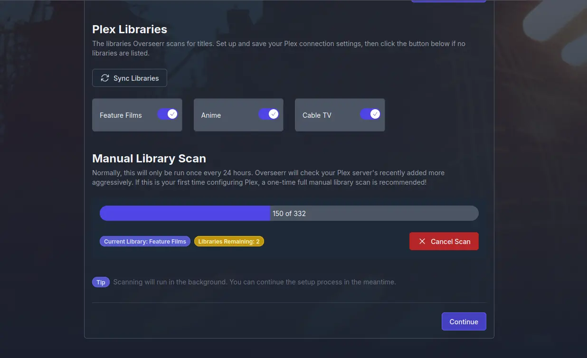

<!--
SPDX-FileCopyrightText: 2025 MASH project contributors
SPDX-FileCopyrightText: 2025 Suguru Hirahara

SPDX-License-Identifier: AGPL-3.0-or-later
-->

# Overseerr

[Overseerr](https://www.overseerr.org/) is a request management and media discovery tool for the Plex ecosystem.

## Dependencies

This service requires the following other services:

- a [Traefik](traefik.md) reverse-proxy server

## Configuration

To enable this service, add the following configuration to your `vars.yml` file and re-run the [installation](../installing.md) process:

```yaml
########################################################################
#                                                                      #
# overseerr                                                            #
#                                                                      #
########################################################################

overseerr_enabled: true

overseerr_hostname: overseerr.example.com

########################################################################
#                                                                      #
# /overseerr                                                           #
#                                                                      #
########################################################################
```

## Usage

After running the command for installation, the Overseerr instance becomes available at the URL specified with `overseerr_hostname`. With the configuration above, the service is hosted at `https://overseerr.example.com`.

>[!NOTE]
> The `overseerr_path_prefix` variable can be adjusted to host under a subpath (e.g. `overseerr_path_prefix: /overseerr`), but this hasn't been tested yet.

To get started, open the URL with a web browser, and follow the prompts to finish setup. The below guide may be useful:

1. Sign in to Overseerr via Plex. You should get a browser pop-up window.


2. Configure Plex. There are a few ways to do this, either by manually filling in the form with your Plex URL or clicking the little 'load' icon the right to populate the drop-down and selecting one of those. Whichever you do, its best to select an option that uses HTTPS. Click the `Save` button.


3. Configure Plex some more. Scroll down and click the `Sync Libraries` button and select the libraries you want Overseerr to know about. Next, click `Start Scan` and then `Continue`.



4. Configure Radarr & Sonarr. The only tricky bit here is getting your API key for the service, which can be obtained at your Radarr/Sonarr `Settings -> General` page.


For additional configuration options, refer to [ansible-role-overseerr](https://github.com/spatterIight/ansible-role-overseerr)'s `defaults/main.yml` file.

## Recommended other services

Consider these other related services:

- [Autobrr](autobrr.md)
- [Jackett](jackett.md)
- [Jellyfin](jellyfin.md)
- [Plex](plex.md)
- [qBittorrent](qbittorrent.md)
- [Radarr](radarr.md)
- [Sonarr](sonarr.md)
