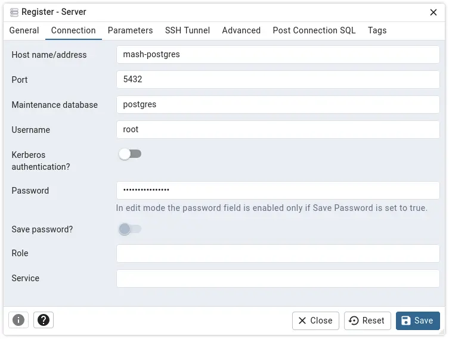

<!--
SPDX-FileCopyrightText: 2020 - 2024 MDAD project contributors
SPDX-FileCopyrightText: 2020 - 2024 Slavi Pantaleev
SPDX-FileCopyrightText: 2020 Aaron Raimist
SPDX-FileCopyrightText: 2020 Chris van Dijk
SPDX-FileCopyrightText: 2020 Dominik Zajac
SPDX-FileCopyrightText: 2020 Mickaël Cornière
SPDX-FileCopyrightText: 2022 François Darveau
SPDX-FileCopyrightText: 2022 Julian Foad
SPDX-FileCopyrightText: 2022 Warren Bailey
SPDX-FileCopyrightText: 2023 Antonis Christofides
SPDX-FileCopyrightText: 2023 Felix Stupp
SPDX-FileCopyrightText: 2023 Julian-Samuel Gebühr
SPDX-FileCopyrightText: 2023 Pierre 'McFly' Marty
SPDX-FileCopyrightText: 2024 Thomas Miceli
SPDX-FileCopyrightText: 2024 - 2025 Suguru Hirahara

SPDX-License-Identifier: AGPL-3.0-or-later
-->

# pgAdmin

The playbook can install and configure [pgAdmin](https://www.pgadmin.org/) for you.

pgAdmin is a management tool for Postgres with a graphical interface which simplifies the creation, maintenance and use of database objects.

See the project's [documentation](https://www.pgadmin.org/docs/pgadmin4/latest/) to learn what pgAdmin does and why it might be useful to you.

For details about configuring the [Ansible role for pgAdmin](https://app.radicle.xyz/nodes/seed.radicle.garden/rad%3Aztixjo2qUzCBLADieR3hKkYEk4eE), you can check them via:
- 🌐 [the role's documentation](https://app.radicle.xyz/nodes/seed.radicle.garden/rad%3Aztixjo2qUzCBLADieR3hKkYEk4eE/tree/docs/configuring-pgadmin.md) online
- 📁 `roles/galaxy/pgadmin/docs/configuring-pgadmin.md` locally, if you have [fetched the Ansible roles](../installing.md)

## Dependencies

This service requires the following other services:

- [Traefik](traefik.md) reverse-proxy server

## Adjusting the playbook configuration

To enable this service, add the following configuration to your `vars.yml` file and re-run the [installation](../installing.md) process:

```yaml
########################################################################
#                                                                      #
# pgadmin                                                              #
#                                                                      #
########################################################################

pgadmin_enabled: true

pgadmin_hostname: pgadmin.example.com

########################################################################
#                                                                      #
# /pgadmin                                                             #
#                                                                      #
########################################################################
```

You also need to specify an email address and password for the initial administrator of the pgAdmin instance. See [this section](https://app.radicle.xyz/nodes/seed.radicle.garden/rad%3Aztixjo2qUzCBLADieR3hKkYEk4eE/tree/docs/configuring-pgadmin.md#set-email-address-and-password-for-initial-administrator) on the role's documentation for details.

## Usage

After running the command for installation, the pgAdmin instance becomes available at the URL specified with `pgadmin_hostname`. With the configuration above, the service is hosted at `https://pgadmin.example.com`.

To get started, open the URL with a web browser to log in to the instance with the administrator account.

>[!NOTE]
>
> - As some commands are destructive and cannot be undone, it is **highly recommended** to have a look at the [documentation](https://www.pgadmin.org/docs/pgadmin4/latest/index.html) to learn its usage before running them against the actual database. The documentation is also available on the instance at `https://pgadmin.example.com/help/help/index.html`.
> - Since enabling pgAdmin with this playbook exposes the instance (thus practically the Postgres database as well) to the internet, it is important to set a proper method to restrict who can access to it, such as [two-factor authentication](https://www.pgadmin.org/docs/pgadmin4/latest/mfa.html). Enabling [OAuth2 authentication](https://www.pgadmin.org/docs/pgadmin4/latest/oauth2.html) is also worth considering.

### Connecting to the Postgres server managed by the MASH playbook

To connect to the Postgres server which you manage with this playbook, you need to register it on the UI. Refer to [this page](https://www.pgadmin.org/docs/pgadmin4/latest/connecting.html) on the documentation for details.

To register it, set `mash-postgres` to the `Host name/address` input field on the modal window for the registration. The default username is `root`, and its password is the one specified to `postgres_connection_password` on your `vars.yml` file.

[](../assets/pgadmin/register.webp)

## Troubleshooting

See [this section](https://app.radicle.xyz/nodes/seed.radicle.garden/rad%3Aztixjo2qUzCBLADieR3hKkYEk4eE/tree/docs/configuring-pgadmin.md#troubleshooting) on the role's documentation for details.

## Related services

- [Adminer](adminer.md) — Full-featured database management tool written in PHP
- [phpMyAdmin](phpmyadmin.md) — Free software written in PHP to handle the administration of a MySQL or MariaDB database server over the web
