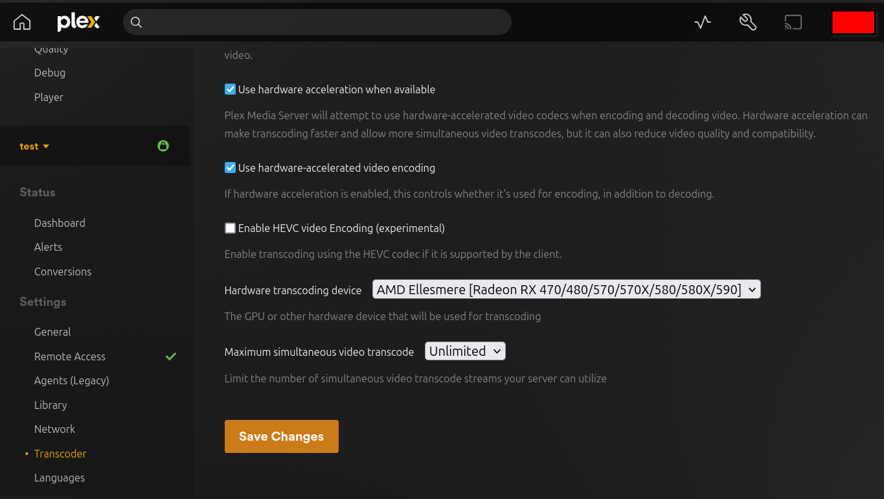

# Plex

[Plex](https://www.plex.tv/) is a personal media server that allows you to organize and stream your collection of movies, TV shows, music, and photos.

## Dependencies

This service requires the following other services:

- a [Traefik](traefik.md) reverse-proxy server

## Configuration

To enable this service, add the following configuration to your `vars.yml` file and re-run the [installation](../installing.md) process:

```yaml
########################################################################
#                                                                      #
# plex                                                                 #
#                                                                      #
########################################################################

plex_enabled: true

plex_hostname: plex.example.com

# The path where media files are stored on the host system (defaults to /mash/plex/media)
plex_media_path: "{{ plex_base_path }}/media"

# The path at which plex_media_path is mounted to inside the container
# Takes a path value (e.g. "/media"), or empty string to not mount.
plex_media_bind_path: "/media"

# Since the container is NOT run in 'host' networking mode
# it is required that a claim token be provided during first time setup
#
# Link to obtain -> https://plex.tv/claim
# Keep in mind that the claim token expires after 4 minutes.
plex_claim_token: ""

########################################################################
#                                                                      #
# /plex                                                                #
#                                                                      #
########################################################################
```

## First-time setup

Due to an [upstream bug](https://github.com/linuxserver/docker-plex/issues/422) there is a bit of a dance you must do when setting up Plex for the first time. The dance is as follows:

1. Run [installation](../installing.md) with `plex_claim_token` set to `""`
2. Obtain a `plex_claim_token` from https://plex.tv/claim. 
3. Run [installation](../installing.md) again with `plex_claim_token` set to the token you obtained

If you do not follow these steps you will get an error like: `s6-applyuidgid: fatal: unable to set supplementary group list: Operation not permitted`. If this happens simply follow the steps above.

Once the server has been successfully claimed you can remove the `plex_claim_token` variable.

## Usage

Once you have completed [first-time setup](#first-time-setup) you should access your new Plex instance at the URL you've chosen. Follow the prompts to finish setup. When prompted to add your media libraries keep in mind that it will be the path **inside** the container, most likely some variation of your `plex_media_bind_path` variable.

### Exposing ports 

By default no ports are exposed, but you'll most likely want to adjust this. The below defines what these ports are and why you may want to expose them.

```yaml
# The main Plex webserver port, you'll want to set this variable (and configure port-forwarding in your router) if you want to access Plex from https://app.plex.tv
# Or if you want to access Plex via TV and phone apps
plex_container_http_bind_port: 32400

# These are GDM network discovery ports, used by Plex clients on the same network 
# to discover your server and connect to it locally, which is faster than reaching out to https://app.plex.tv
# and connecting back to your server via its external IP address
plex_container_gdm_bind_port_01: 32410
plex_container_gdm_bind_port_02: 32412
plex_container_gdm_bind_port_03: 32413
plex_container_gdm_bind_port_04: 32414

# Access to the Plex DLNA server
# You probably don't need this
plex_container_dlna_udp_bind_port: 1900
plex_container_dlna_tcp_bind_port: 32469

# A special port used for controlling Plex for Roku via Plex Companion
# You probably don't need this, and the Plex for Roku app doesn't require it
plex_container_roku_bind_port: 8324

# A older Bonjour/Avahi network discovery port
# You probably don't need this
plex_container_bonjour_port: 5353
```
Upstream documentation #1: https://support.plex.tv/articles/201543147-what-network-ports-do-i-need-to-allow-through-my-firewall/
Upstream documentation #2: https://docs.linuxserver.io/images/docker-plex/#umask-for-running-applications

### Hardware Acceleration

To enable hardware acceleration you'll first need to determine your GPU brand. Once you've done this, read the corresponding section below:

#### Intel/ATI/AMD

For Intel/ATI/AMD GPUs enabling hardware acceleration is as easy as mounting the device into the container:

```yaml
# The path where the Intel/ATI/AMD GPU is on the host system
plex_gpu_path: "/dev/dri"

# The path to mount the Intel/ATI/AMD GPU to in the container.
# Takes a path value (e.g. "/dev/dri"), or empty string to not mount.
plex_gpu_bind_path: "{{ plex_gpu_path }}"
```

Upstream documentation: https://docs.linuxserver.io/images/docker-plex/#intelatiamd

#### NVIDIA

For NVIDIA GPUs enabling hardware acceleration is a little bit tricky since it (currently) requires the manual installation of the [NVIDIA container runtime](https://github.com/NVIDIA/nvidia-container-toolkit). Consult your distribution's documentation on installing this.

Once the runtime is installed and available, add the following configuration:

```yaml
# The container runtime that the container engine should use
plex_container_runtime: "nvidia"

# To enable NVIDIA GPU hardware acceleration this value should either be 'all' or the UUID value of the GPU
# which can obtained with the command -> 'nvidia-smi --query-gpu=gpu_name,gpu_uuid --format=csv'
plex_nvidia_visible_devices: "all"
```

Upstream documentation: https://docs.linuxserver.io/images/docker-plex/#nvidia

---

To verify Plex is detecting your GPU navigate to `Settings -> Transcoder -> Hardware transcoding device` and select your GPU. If you do not see the `Hardware transcoding device` drop-down make sure you have ticked the `Use hardware acceleration when available` checkbox. If everything is working right you should see something like this:



### Mounting additional media directories

To mount additional media directories, or to simply mount a directory without changing its permissions, the following configuration is available:

```yaml
plex_container_additional_volumes:
  - type: bind
    src: /path/on/the/host/movies
    dst: /movies
    
  - type: bind
    src: /another-path/on/the/host/anime
    dst: /anime
    options: readonly
```

### Plex Pass updates

To enable Plex Pass updates you will (unfortunately) have to run the container as a root user AND have to disable the container being in read-only mode. You'll also want to set `plex_version_environment_variable` to `latest` or `public`:

```yaml
# The user/group to run the application as
# In the below example, '0:0' indicates the root user and root group
plex_uid: '0'
plex_gid: '0'

# Controls whether the container filesystem is read-only
plex_container_read_only: false

# Valid settings for 'plex_version_environment_variable' are:
#
# 1: docker: Let Docker handle the Plex Version, we keep our Dockerhub Endpoint up to date with the latest public builds.
# 2: latest: will update plex to the latest version available that you are entitled to.
# 3: public: will update plexpass users to the latest public version, useful for plexpass users that don't want to be on the bleeding edge but still want the latest public updates.
# 4: <specific-version>: will select a specific version (eg 0.9.12.4.1192-9a47d21) of plex to install, note you cannot use this to access plexpass versions if you do not have plexpass.
#
# NOTE -> You cannot update to a PlexPass only (beta) version if you are not logged in with a PlexPass account
plex_version_environment_variable: latest
``` 

## Recommended other services

Consider these other supported services that are also in the [*Arr stack](https://wiki.servarr.com/) of media automation tools:

- [Radarr](radarr.md)
- [Sonarr](sonarr.md)
- [Jackett](jackett.md)
- [qBittorrent](qbittorrent.md)
- [Overseerr](overseerr.md)
