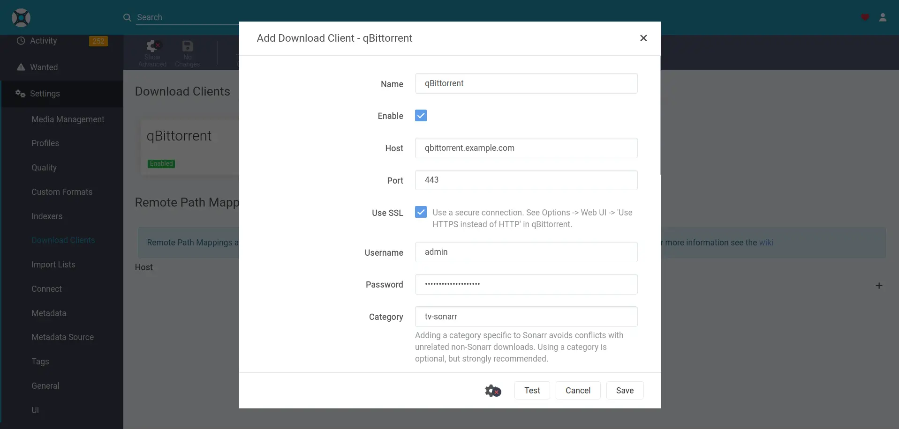

<!--
SPDX-FileCopyrightText: 2023 Alejandro AR
SPDX-FileCopyrightText: 2023 Nikita Chernyi
SPDX-FileCopyrightText: 2023, 2024 Julian-Samuel Gebühr
SPDX-FileCopyrightText: 2023, 2024 Sergio Durigan Junior
SPDX-FileCopyrightText: 2023-2025 MASH project contributors
SPDX-FileCopyrightText: 2023-2025 Slavi Pantaleev
SPDX-FileCopyrightText: 2024 Katherine Door
SPDX-FileCopyrightText: 2024 Oliver Lorenz
SPDX-FileCopyrightText: 2025 Gergely Horváth
SPDX-FileCopyrightText: 2025 XHawk87
SPDX-FileCopyrightText: 2025 spatterlight
SPDX-FileCopyrightText: 2025, 2026 Suguru Hirahara

SPDX-License-Identifier: AGPL-3.0-or-later
-->

# qBittorrent

[qBittorrent](https://www.qbittorrent.org/) is a BitTorrent client programmed in C++ / Qt that uses libtorrent.

## Dependencies

This service requires the following other services:

- a [Traefik](traefik.md) reverse-proxy server

## Configuration

To enable this service, add the following configuration to your `vars.yml` file and re-run the [installation](../installing.md) process:

```yaml
########################################################################
#                                                                      #
# qbittorrent                                                          #
#                                                                      #
########################################################################

qbittorrent_enabled: true

qbittorrent_hostname: qbittorrent.example.com

# The path where downloaded files will be stored on the host system
qbittorrent_download_path: "{{ qbittorrent_base_path }}/downloads"

# The path at which qbittorrent_download_path is mounted to inside the container
qbittorrent_download_bind_path: "/downloads"

# The port qBittorrent is listening for torrents on inside the container
qbittorrent_container_torrenting_port: 6881

# Controls whether the container exposes its torrenting port
# To become an "active node" you'll want to set this and configure port-forwarding in your router
qbittorrent_container_torrenting_bind_port: "{{ qbittorrent_container_torrenting_port }}"

########################################################################
#                                                                      #
# /qbittorrent                                                         #
#                                                                      #
########################################################################
```

## Usage

After running the command for installation, the qBittorrent instance becomes available at the URL specified with `qbittorrent_hostname`. With the configuration above, the service is hosted at `https://qbittorrent.example.com`.

>[!NOTE]
> The `qbittorrent_path_prefix` variable can be adjusted to host under a subpath (e.g. `qbittorrent_path_prefix: /qbittorrent`), but this hasn't been tested yet.

To get started, open the URL with a web browser to log in to the instance with the **temporary** randomly generated password for your instance. The password can be obtained by running the command below:

```sh
just run-tags print-qbittorrent-password
```

Once you've got that, log in as the `admin` user with the password and change it under `Tools -> Options -> WebUI` in the `Authentication` section. Make sure you change the password, since the default one is temporary and will change with each start-up.

For additional configuration options, refer to [ansible-role-qbittorrent](https://github.com/mother-of-all-self-hosting/ansible-role-qbittorrent)'s `defaults/main.yml` file.

## Integration with Sonarr/Radarr

To add qBittorrent to your [Sonarr](sonarr.md) or [Radarr](radarr.md) instance navigate to the form at `Settings > Download Clients > Add > qBittorrent`:

Set the `host` field to your qBittorrent URL (without the protocol) and `port` as 443. Make sure to click `Use SSL`. Set the `username` and `password` fields as your qBittorrent credentials.

Fill in the rest of the form with your preferences, and you're done!



## Related services

- [Autobrr](autobrr.md) — Download automation for torrents and Usenet
- [bitmagnet](bitmagnet.md) — BitTorrent indexer, DHT crawler, content classifier and search engine
- [Jackett](jackett.md) — API for torrent trackers
- [Jellyfin](jellyfin.md) — Personal media server
- [Overseerr](overseerr.md) — Request management and media discovery tool for the Plex ecosystem
- [Plex](plex.md) — Personal media server
- [Radarr](radarr.md) — Movie organizer/manager for Usenet and BitTorrent users
- [Sonarr](sonarr.md) — PVR for newsgroup and BitTorrent users
