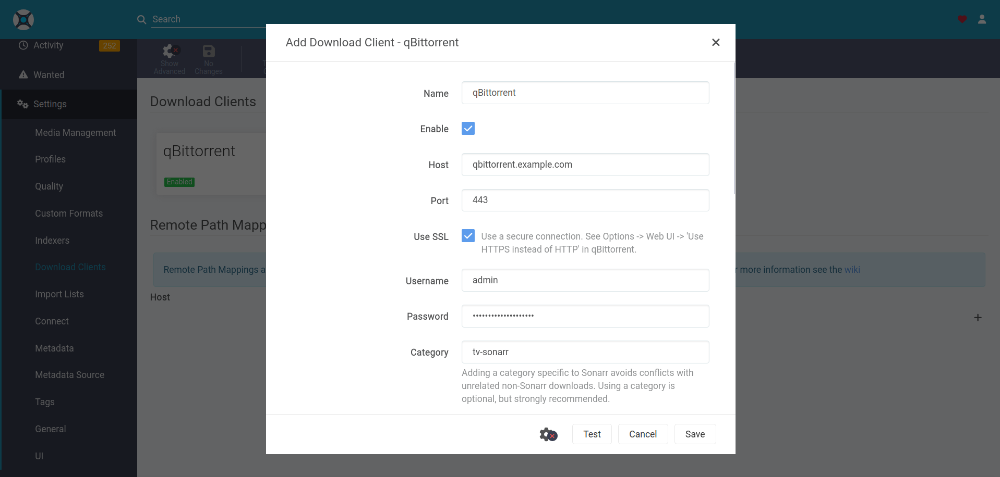

# qBittorrent

[qBittorrent](https://www.qbittorrent.org/) is a bittorrent client programmed in C++ / Qt that uses libtorrent.

## Dependencies

This service requires the following other services:

- a [Traefik](traefik.md) reverse-proxy server

## Configuration

To enable this service, add the following configuration to your `vars.yml` file and re-run the [installation](../installing.md) process:

```yaml
########################################################################
#                                                                      #
# qbittorrent                                                          #
#                                                                      #
########################################################################

qbittorrent_enabled: true

qbittorrent_hostname: qbittorrent.example.com

# The path where downloaded files will be stored on the host system
qbittorrent_download_path: "{{ qbittorrent_base_path }}/downloads"

# The path at which qbittorrent_download_path is mounted to inside the container
qbittorrent_download_bind_path: "/downloads"

# The port qBittorrent is listening for torrents on inside the container
qbittorrent_container_torrenting_port: 6881

# Controls whether the container exposes its torrenting port
# To become an "active node" you'll want to set this and configure port-forwarding in your router
qbittorrent_container_torrenting_bind_port: "{{ qbittorrent_container_torrenting_port }}"

########################################################################
#                                                                      #
# /qbittorrent                                                         #
#                                                                      #
########################################################################
```

## Usage

After [installation](../installing.md), you should access your new qBittorrent instance at the URL you've chosen.

To login you'll need to obtain the randomly generated password for your instance, to get this run `just run-tags print-qbittorrent-password`

Once you've got that, login and change the password under `Tools -> Options -> WebUI` in the `Authentication` section.

For additional configuration options, refer to [ansible-role-qbittorrent](https://github.com/spatterIight/ansible-role-qbittorrent)'s `defaults/main.yml` file.

## Intergration with Sonarr/Radarr

To add qBittorrent to your [Sonarr](sonarr.md) or [Radarr](radarr.md) instance navigate to the form at `Settings > Download Clients > Add > qBittorrent`:

Set the `host` field to your qBittorrent URL (without the protocol) and `port` as 443. Make sure to click `Use SSL`. Set the `username` and `password` fields as your qBittorrent credentials. 

Fill in the rest of the form with your preferences, and you're done!


