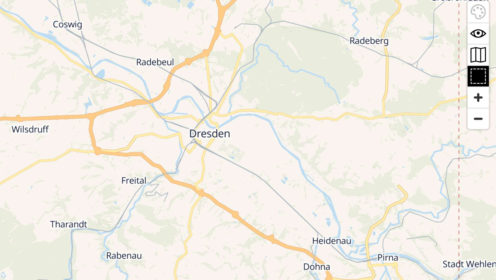

# Versatiles


[Versatiles](https://versatiles.org) is a a free stack for generating and serving vector tiles based on [OpenStreetMap](https://openstreetmap.com) data.


## Dependencies

This service requires the following other services:

- a [Traefik](traefik.md) reverse-proxy server


## Configuration

To enable this service, add the following configuration to your `vars.yml` file and re-run the [installation](../installing.md) process:

```yaml
########################################################################
#                                                                      #
# versatiles                                                           #
#                                                                      #
########################################################################

versatiles_enabled: true

versatiles_hostname: tiles.example.com

########################################################################
#                                                                      #
# /versatiles                                                          #
#                                                                      #
########################################################################
```

In the example configuration above, we configure the service to be hosted at `https://tiles.example.com/`.


## Usage

After installation, you should be able to access your new Versatiles instance at: `https://tiles.example.com`.




To embed the map in a website Copy & Paste the following snippet and replace `tiles.example.com` with your `versatiles_hostname`.

```html
<!-- add MapLibre JavaScript and CSS -->
<script src="https://tiles.example.com/assets/lib/maplibre-gl/maplibre-gl.js"></script>
<link href="https://tiles.example.com/assets/lib/maplibre-gl/maplibre-gl.css" rel="stylesheet" />

<!-- add container for the map -->
<div id="map" style="width:100%;aspect-ratio:16/9"></div>

<!-- start map -->
<script>
  new maplibregl.Map({
    container: 'map',
    style: 'https://tiles.example.com/assets/styles/colorful.json'
  }).addControl(new maplibregl.NavigationControl());
</script>
```

For adjustments, check out the amazing [examples from maplibre](https://maplibre.org/maplibre-gl-js/docs/examples/).
